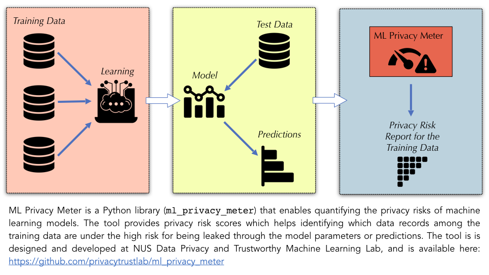
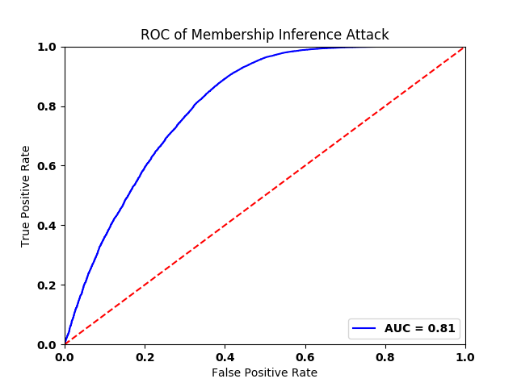
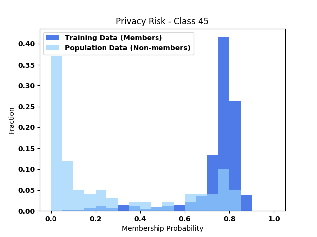

# ML Privacy Meter

Machine learning is playing a central role in automated decision making in a wide range of organization and service providers. The data, which is used to train the models, typically contain sensitive information about individuals. Although the data in most cases cannot be released, due to privacy concerns, the models are usually made public or deployed as a service for inference on new test data. For a safe and secure use of machine learning models, it is important to have a quantitative assessment of the privacy risks of these models, and to make sure that they do not reveal sensitive information about their training data. This is of a great importance as there has been a surge in use of machine learning in sensitive domains such as medical and finance applications. 

Data Protection regulations, such as GDPR, and AI governance frameworks require personal data to be protected when used in AI systems, and that the users have control over their data and awareness about how it is being used. For example, [Article 35 of GDPR](https://gdpr-info.eu/art-35-gdpr/) requires organizations to systematically analyze, identify and minimize the data protection risks of a project, especially when the project involves innovative technologies such as Artificial Intelligence, Machine Learning and Deep Learning. Thus, proper mechanisms need to be in place to quantitatively evaluate and verify the privacy of individuals in every step of the data processing pipeline in AI systems.

ML Privacy Meter is a Python library (`ml_privacy_meter`) that enables quantifying the privacy risks of machine learning models. The tool provides privacy risk scores which help in identifying data records among the training data that are under high risk of being leaked through the model parameters or predictions. Details about how the tool can aid practitioners in regulatory compliance are provided in this [article](https://arxiv.org/pdf/2007.09339.pdf) and its [talk](https://www.youtube.com/watch?v=DWqnKNZTz10).



# Privacy Risks of Machine Learning Models

Machine learning models encode information about the datasets on which they are trained. The encoded information is supposed to reflect the general patterns underlying the population data. However, it is commonly observed that these models memorize specific information about some members of their training data. This is reflected in the predictions of a model, which exhibit a different behavior on training data versus test data, and in the model's parameters which store statistically correlated information about specific data points in their training set.  Models with high generalization gap as well as the models with high capacity (such as deep neural networks) are more susceptible to memorizing data points from their training set. 

Recent inference algorithms, e.g., [[1](https://www.comp.nus.edu.sg/~reza/files/Shokri-SP2017.pdf), [2](https://www.comp.nus.edu.sg/~reza/files/Shokri-SP2019.pdf)], have demonstrated this vulnerability of machine learning models and crafted attacks to extract information about the training data of models. Specifically these algorithms detect the presence of a particular record in the training dataset of a model, thus called *membership inference attacks*. The privacy risks of models, with respect to their predictions (black-box setting) and parameters (white-box setting), can be evaluated as the accuracy of such attacks against their training data. **ML Privacy Meter** implements membership inference attacks in both the black-box and white-box settings. Ability to detect membership in the dataset using the released models is a measure of information leakage about the individuals in the dataset from the model.

In the black-box setting, we can only observe predictions of the model. The attack involves training inference algorithms that can distinguish between training set members and non-members from the model predictions. This scenario can be used to measure the privacy risks against legitimate users of a model who seek predictions on their queries. In the white-box setting, we can also observe the parameters of the model. This reflects the scenario where a model is outsourced to a potentially untrusted server or to the cloud, or is shared with an aggregator in the federated learning setting. 

Membership probability (in the range of 0-1) is calculated for all the records in the training data using the attack. This is compared with that of test data to determine if the model leaks the presence of its members to the attacker. When an attacker tries to detect the presence of an individual in the dataset, there is a trade-off between its achieved power and error. Power refers to the fraction of individuals in the training dataset that the attacker can correctly identify as members. Error refers to the fraction of individuals that the attacker claims as members of dataset but are not part of the dataset. The tool can quantify and report the membership probability and accuracy of the attack per record, to reflect the privacy risk of the model for each record. It also reports the aggregated results. 

# Data protection impact assessment

For projects involving innovative technologies such as machine learning, it is mandatory from Article 35 of the GDPR to perform a Data Protection Impact Assessment (DPIA). The key steps in DPIA are to identify the potential threats to data and assess how they might affect individuals. In general, risk assessment in DPIA statements focuses on the risk of security breaches and illegitimate access to the data. Machine learning models pose additional privacy risk to the training data by indirectly revealing about it through the model's predictions and parameters. Hence, special attention needs to be paid for data protection rules in AI regulation frameworks. 

Guidances released by both the [European Commission](https://ec.europa.eu/info/sites/info/files/commission-white-paper-artificial-intelligence-feb2020_en.pdf) and the [White House](https://www.whitehouse.gov/wp-content/uploads/2020/01/Draft-OMB-Memo-on-Regulation-of-AI-1-7-19.pdf) call for protection of personal data during all the phases of deploying AI systems and build systems that are resistant to attacks. Recent reports published by the [Information Commissioner’s Office (ICO) for auditing AI](https://ico.org.uk/media/about-the-ico/consultations/2617219/guidance-on-the-ai-auditing-framework-draft-for-consultation.pdf) and the [National Institute of Standards and Technology (NIST) for securing applications of Artificial Intelligence](https://nvlpubs.nist.gov/nistpubs/ir/2019/NIST.IR.8269-draft.pdf) highlight the privacy risk to data from machine learning models. And they specifically mention membership inference as a confidentiality violation and potential threat to the training data from models. It is recommended in the auditing framework by ICO for organizations to identify these threats and take measures to minimize the risk. As the ICO’s investigation teams will be using this framework to assess the compliance with data protection laws, organizations must account for and estimate the privacy risks to data through models. 

ML privacy meter can help in DPIA by providing a quantitative assessment of privacy risk of a machine learning model. The tool can generate extensive privacy reports about the aggregate and individual risk for data records in the training set at multiple levels of access to the model. It can estimate the amount of information that can be revealed through the predictions of a model (referred to as Black-box access) and through both the predictions and parameters of a model (referred to as White-box access). Hence, when providing query access to the model or revealing the entire model, the tool can be used to assess the potential threats to training data.

# Overview of ML Privacy Meter

## Setup

The API is built on top of `TensorFlow 2.1` with Python 3.6. `TensorFlow` can be installed [in a virtual environment](https://www.tensorflow.org/install/pip#2.-create-a-virtual-environment-recommended).

Install the dependencies and the library for the tool:
```
~$ pip install -r requirements.txt
~$ pip install -e .
```

The library uses GPU for optimal execution. For more details on TensorFlow GPU support, [look here](https://www.tensorflow.org/install/gpu).

**Note** :  Though `ml_privacy_meter` makes use of the [Eager Execution](https://www.tensorflow.org/guide/eager) mode of TensorFlow, `"tf.enable_eager_execution()"` need not be called explicitly. Importing `ml_privacy_meter` will do that job for you.

## Data 

To use `ml_privacy_meter's` datahandler, the datasets need to be in a particular format.  README in `datasets/`  directory contains the details about the required format. It also has scripts to download some datasets in the required format. 

## Analyzing a Trained Model

`ml_privacy_meter` creates a customized attack model by choosing the elements of an already trained classification model. This could include the gradients (of layers with trainable parameters), intermediate outputs of hidden layers, output of the target model and value of loss function to train the inference model. These are the signals that the inference algorithm uses to perform the membership inference attack and distinguish between members of the training set and population data.  `ml_privacy_meter.attacks.meminf` can be used to run inference attacks against any target classification model.

#### Sample code to run a whitebox attack

In this example, the number of epochs is set to 100 and the attack model exploits the intermediate activations of last 3 layers and the gradients of the last layer on a fully connected neural network as the target model. This target model consists of 5 layers. Here, both the target classification models (used for training and the one evaluated on) are the same, but they can differ [See Note 1]. For the `blackbox` attack (exploiting only the output of final classification layer), the output dimension of Model A and B needs to be the same, whereas rest of the architecture can be different. For `whitebox` attack, the architectures need to be same. The difference between Model A and Model B for such an attack is that Model B could be trained on a different dataset.

Important arguments among them:

- dataset_path : path to the whole dataset (in .txt format). This is required to sample non-members.
- saved_path: Path of the saved training data of the target classification model. It has to be in a `.npy` format. The saved dataset is used to sample members.
- batch_size: batch size for training the attack model.
- attack_percentage: percentage of training data that'll be used for attack. This fraction will determine the number of members and non members that'll form the training dataset for attack model.

To attack:
```
attackobj = ml_privacy_meter.attacks.meminf.initialize(
                 target_train_model=cmodel, 
                 target_attack_model=cmodel, 
                 train_datahandler=datahandler, 
                 attack_datahandler=datahandler, 
                 optimizer="adam", 
                 layers_to_exploit = [3,4,5],
                 gradients_to_exploit = [5],
                 exploit_loss=True,
                 exploit_label=True,                 
                 learning_rate=0.0001, 
                 epochs=100)

 # Begins training the attack model. 
attackobj.train_attack()             
 
 # The attack accuracy for the attack model is evaluated during training itself on a 
 # validation/ test set that is reported on the best performing attack model 
 # (out of all the epochs).
```        

The description of the arguments:

- `target_train_model`: the target classification model used to train the attack model  
- `target_attack_model`: the target classification  model used to evaluate the attack model   [See Note 2]
- `train_datahandler`: datahandler of `target_train_model`
- `attack_datahandler`: datahandler of `target_attack_model` 
- `optimizer`: `optimizer` op for training the attack model.
- `layers_to_exploit`: a list of layer indices of which the intermediate outputs will be exploited. This should be the index of the layer in the model.
- `gradients_to_exploit`: a list of layer indices of which the gradients will be exploited. This should be the index of the layers with trainable parameters.
- `exploit_loss`: Boolean. `True` implies loss value of the target model will be exploited. 
- `exploit_label`: Boolean. `True` implies one-hot encoded labels will be exploited.                 
- `learning_rate`: learning rate of the optimizer op
- `epochs`: The number of epochs to train the attack model.

Note 1: The `meminf` class can also be used to train the attack model on a target classification model (call it model A) and evaluate it on a different classification model (call it model B). Model A's training set is used for training the attack model and model B's test set is used for evaluating the attack model (with no intersection among them).

Note 2: The `target_attack_model` is not a attack model but rather a classification model that the attack model will be evaluated on.

A tutorial to run the attack on CIFAR-100 Alexnet model can be found [here](tutorials/README.md).

# Report and Visualization of the Results

The attack models can be visualized in Tensorboard's dashboard. The user can view the privacy risk of the model, ROC of membership inference attack, compare privacy risk between datapoints from different classes. 
To create the visualizations, the user needs to call
```
attackobj.test_attack()
```
This function can be called for different instances of the attack setup, `attackobj` (ml_privacy_meter.attack.meminf) to compare them.

A set of plots are generated for the data, which includes histograms for privacy risk, ROC curve for the membership probabilities, gradient norm distributions for member and non-member data, and label-wise privacy risk plots. This data is created in the `logs/plots` folder. 

The below are some sample plots created for the blackbox setting, where the attacker can exploit the final layer outputs, loss and label.

The below plot shows the histogram of the membership probabilities for training set member data and non-member data from the population. A higher membership probability shows that the model has predicted a higher probability that the data is part of the training data.


The next plot shows the Receiver Operating Characteristic (ROC) curve for the membership inference attack. It also displays the AUC value for the plot.



The user can also use privacy risk histograms for each output class.

   

The membership probability predictions for training set member data and population set non-member data by the model are also saved as numpy files in the `logs` folder as `member_probs.npy` and `nonmember_probs.npy`. They correspond to the features and labels in `m_features.npy`, `m_labels.npy` and `nm_features.npy` and `nm_labels.npy` respectively.

## References

1. R. Shokri, M. Stronati, C. Song, and V. Shmatikov. [Membership Inference Attacks against Machine Learning Models](https://www.comp.nus.edu.sg/~reza/files/Shokri-SP2017.pdf) in IEEE Symposium on Security and Privacy, 2017.
2. M. Nasr, R. Shokri, and A. Houmansadr. [Comprehensive Privacy Analysis of Deep Learning: Stand-alone and Federated Learning under Passive and Active White-box Inference Attacks](https://www.comp.nus.edu.sg/~reza/files/Shokri-SP2019.pdf) in IEEE Symposiumon Security and Privacy, 2019.

## Contributors

The tool is designed and developed at NUS Data Privacy and Trustworthy Machine Learning Lab. Current contributers are: Aadyaa Maddi, Sasi Kumar Murakonda, and Reza Shokri. Earlier contributors were Milad Nasr, Shadab Shaikh, and Mihir Harshavardhan Khandekar.

<p float="left">


</p>
